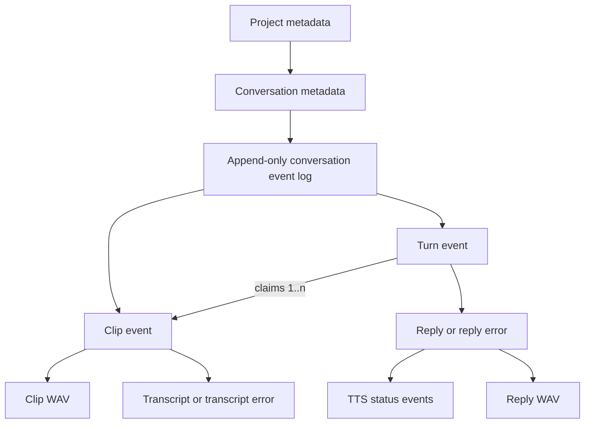

# Current data model

This document describes the data model implemented today. It is an inventory,
not a proposal for the next model. The server is authoritative once a recording
has been uploaded; the browser, iPhone, and Watch also keep pre-upload durability
state locally.

## Mental model

Kibo is a filesystem-backed, event-sourced system organized into projects and
conversations.



The important distinction is that `turns.jsonl` is the source of truth for a
conversation's content and processing history, but it is not the whole data
model:

- `project.json` and `conversation.json` are authoritative for hierarchy and
names. Conversation metadata also contains a derived recent-activity cache.
- `turns.jsonl` is authoritative for clips, transcripts, turns, replies, and
processing outcomes.
- WAV files contain the actual recorded and synthesized audio. An event log
alone cannot reconstruct those bytes.
- In-memory worker and streaming state can be discarded and reconstructed from
durable state, with the caveats listed below.

There is no database, global active project, global active conversation, schema
version, migration framework, or compaction step. `last_activity_at` is the one
denormalized index-like value; it is rebuilt from the event log at startup.

## On-disk server layout

`KIBO_DATA_DIR` defaults to `~/kibo-data`.

```text
kibo-data/
  .kibod.lock
  projects/
    <project-id>/
      project.json
      knowledge/
        instructions.md
        ingested.json
        web/
          <source-id>/
            source.json
            versions/<content-sha256>/content.md
        wiki/
          index.md
          sources/<kind>--<source-id>.md
      conversations/
        <conversation-id>/
          conversation.json
          turns.jsonl
          clips/
            <clip-id>.wav
          tts/
            <turn-id>.wav
```

`.kibod.lock` is held exclusively for the life of the process, preventing two
`kibod` processes from writing the same data directory. Within a process,
mutations and reads that must be consistent are serialized with one mutex per
`project-id/conversation-id`.

If no projects are found when the store opens, the server creates the starter
project `kibo`. Projects may contain zero conversations; the starter project
and newly created projects do not receive a special `general` conversation.

## Metadata records

### Project

```json
{
  "id": "kibo",
  "name": "Kibo",
  "created_at": 1784142000
}
```

| Field | Meaning |
|---|---|
| `id` | Stable path and API identifier. |
| `name` | Display name, trimmed and limited to 1–100 characters at creation. |
| `created_at` | Server epoch seconds. Used to sort project lists oldest first. |

Creating a project creates only its metadata and empty `conversations/`
directory. There are no project update or delete operations.

### Conversation

```json
{
  "id": "new-conversation-e2a93b17",
  "project_id": "kibo",
  "name": "New conversation",
  "name_source": "placeholder",
  "created_at": 1784142000,
  "last_activity_at": 1784142000
}
```

| Field | Meaning |
|---|---|
| `id` | Stable identifier unique within its project. |
| `project_id` | Owning project. The server checks this when loading the record. |
| `name` | Current display name. |
| `name_source` | `placeholder`, `transcript`, `manual`, or `ai`. `ai` exists in the Rust enum but is not currently produced. |
| `created_at` | Server epoch seconds for chat creation. |
| `last_activity_at` | Derived epoch seconds for the newest durable event, falling back to `created_at`. Conversation lists sort by this value newest first. |

An unnamed conversation starts as `New conversation` with `placeholder` as its
source. After a successful, useful transcript arrives, the server derives a
title from the first useful transcript event: at most eight words and 60
Unicode characters. The metadata file is atomically replaced, the source
becomes `transcript`, and a `conversation_renamed` event is appended. A manual
name is never auto-replaced. Older metadata without `name_source` decodes as
`manual`; older metadata without `last_activity_at` is accepted and backfilled
from the durable log when the store opens.

There is currently no API for renaming or deleting a conversation. The
automatic rename and recent-activity cache are the only metadata updates after
creation.

## Project knowledge workspace

Each project can compile raw conversations and imported URLs into readable
Markdown. This is one concrete built-in feature, not a generic capability
registry. Conversation logs remain authoritative; knowledge files are derived
and can be regenerated.

`instructions.md` contains the project-local instructions used to generate one
source note. `wiki/index.md` is rebuilt deterministically from successful
receipts. Each generated source note has provenance frontmatter containing its
stable source key, kind, content SHA-256, generation, and URL when applicable.

### Canonical conversation documents

Conversation ingestion reconstructs ordered user transcript and assistant reply
sections from `turns.jsonl`. Empty and silent sentinels are excluded. Audio,
errors, rename notifications, and speech-processing events are not part of the
canonical bytes, so events such as `speech_ready` do not make an ingested
conversation dirty.

The canonical bytes are hashed but not copied into a second raw snapshot. The
existing conversation log remains the sole authority.

### Imported URL documents

The browser UI sends a public HTTP(S) URL to Jina Reader and stores its Markdown
result under `web/<source-id>/versions/<content-sha256>/content.md`.
Re-importing the same URL reuses its stable source ID. Identical content is
clean; changed content creates another immutable content-addressed version and
advances `source.json` only after the new content is durable.

### Successful ingestion checkpoint

`ingested.json` records only successful work, keyed by stable logical source
keys such as `conversation:<id>` and `web:<id>`. A receipt contains the source
content hash, knowledge-instructions hash, recipe version, generation, time,
title, kind, and wiki filename.

A source is dirty when its canonical content hash, instructions hash, or recipe
version differs from its last successful receipt. A manual re-ingest bypasses
that comparison. The generated source note and index are atomically replaced
before `ingested.json`; a failure before the checkpoint therefore leaves the
source dirty and safe to retry. Knowledge writes are serialized per project.

### IDs and timestamps

Server-generated IDs are a short lowercase ASCII slug plus an eight-character
UUID suffix. API-supplied project, conversation, clip, and turn IDs must be
1–100 ASCII characters containing only letters, digits, `-`, or `_`.

All durable timestamps use whole epoch seconds:

- `created_at` is assigned by the server to project/conversation metadata.
- `last_activity_at` caches the maximum durable event `at` for a conversation.
- `at` is assigned by the server to each event.
- `recorded_at` is supplied by the client for clips, defaulting to server time
only if the header is missing or invalid.

The server trusts `recorded_at`. It is not checked against `at` or other clips.

## Conversation event log

Each conversation has an independent append-only `turns.jsonl`. Every complete
line is a JSON object. All events currently have this envelope:

```json
{
  "kind": "...",
  "seq": 1,
  "at": 1784142000
}
```

- `seq` starts at 1 and increases monotonically within one conversation.
- `at` is server epoch seconds.
- `kind` selects the remaining fields.

The server does not define a typed Rust event enum. It appends and reads
`serde_json::Value`, so required fields and relationships are enforced by the
code paths that happen to consume each event rather than by one central schema.

### Event types

The table omits the common `kind`, `seq`, and `at` fields.

| Kind | Additional fields | Meaning |
|---|---|---|
| `clip` | `id`, `file`, `mime`, `ms`, `peak`, `recorded_at`, `sha256` | A committed user recording. `file` is currently `clips/<id>.wav`, `mime` is `audio/wav`, `ms` is client-reported duration, and `peak` is a client-reported percentage capped at 100. |
| `transcript` | `clip`, `text` | Successful transcription of a clip. Peak-zero clips get the sentinel text `[silent]` without calling the provider. |
| `transcript_error` | `clip`, `error` | A transcription attempt failed. This is not permanently terminal: restart recovery will try the clip again. |
| `turn` | `id`, `clips` | An explicit request for Kibo to answer. It atomically claims all clips that are unclaimed at creation time. |
| `reply` | `turn`, `text`, `answers`; usually `audio`, `interaction_id` | Durable assistant text for a turn. `answers` repeats the claimed clip IDs. A normal reply advertises `tts/<turn>.wav` before synthesis finishes. Empty/silent input produces `[nothing to answer]` without audio. |
| `reply_error` | `turn`, `error` | Reply processing failed. Current server and clients do not agree completely on whether this is terminal; see “Current sharp edges.” |
| `tts_error` | `turn`, `error` | Speech synthesis or speech-file persistence failed for an already-durable reply. |
| `speech_ready` | `turn`, `samples`, `rate`; optional `recovered` | The final reply WAV is durable. `rate` is currently 24,000 Hz; `recovered: true` means the file existed after restart but its ready event did not. |
| `conversation_renamed` | `name`, `source` | Notification that conversation metadata was automatically renamed. `source` is currently `transcript`. |

Events are facts rather than rows to update. A later event can supersede an
earlier outcome, for example:

```text
transcript_error -> transcript
tts_error -> speech_ready
```

There is no explicit attempt number, retry count, causal-event ID, schema
version, or canonical status field. Consumers derive status by scanning the
log.

## Relationships and derived state

Relationships are stored as string IDs rather than enforced foreign keys:

- `conversation.project_id -> project.id`
- `clip.file -> clips/<clip.id>.wav`
- `transcript.clip -> clip.id`
- `transcript_error.clip -> clip.id`
- `turn.clips[] -> clip.id`
- `reply.turn -> turn.id`
- `reply.answers[] -> clip.id` (redundant with `turn.clips[]`)
- `reply.audio -> tts/<turn.id>.wav`
- `reply_error.turn`, `tts_error.turn`, and `speech_ready.turn -> turn.id`

The code assumes these references are valid. It does not validate the full log
on load or reject every possible duplicate logical record.

### Pending clips

A clip is pending when its ID does not occur in any `turn.clips` array. Asking
Kibo creates one turn that claims every pending clip in the conversation. The
claim is serialized with event appends and is therefore atomic relative to
uploads and other turn submissions.

Claimed clips are sorted by `(recorded_at, seq)`, not merely upload order. This
allows offline recordings uploaded later to retain client capture order. It
also means an inaccurate client clock affects the order of text sent to the
model.

### Turn completion

The server treats a durable `reply` as the completion marker for model work. A
reply's text and audio have separate durability boundaries:

1. `reply` is appended before TTS begins.
2. While synthesis is active, speech can be streamed from memory.
3. The final WAV is atomically written to `tts/<turn>.wav`.
4. `speech_ready` is appended.

Consequently, `reply.audio` means “this reply has a speech resource,” not “the
final speech file is already ready.” `speech_ready` or the speech endpoint is
the authoritative readiness check.

### Conversation history sent to the model

For a new turn, the server walks earlier `turn` events in log order and includes
only turns that have both transcript text and a reply. A user history message is
the turn's transcript texts joined with newlines; the assistant message is the
reply text.

The latest earlier `reply.interaction_id` is offered to Gemini as a provider-side
continuation cache. If Gemini rejects it, Kibo rebuilds the prompt from the
durable history. Provider state is therefore an optimization, not the source of
truth.

The current-turn path filters empty, `[silent]`, and `[no speech]` transcripts
before asking the model. The durable-history reconstruction does not apply the
same sentinel filter, so earlier sentinel exchanges can enter a fallback
prompt.

## Write and processing lifecycle

### 1. Record and upload a clip

Before the server sees a clip, each frontend tries to save it in a local retry
spool. The client then sends a whole WAV with a stable clip ID, SHA-256, duration,
peak, and recording time.

On the server:

1. The API buffers up to 20 MiB and checks the RIFF/WAVE header.
2. The store verifies the supplied SHA-256.
3. It writes a unique temporary file, syncs it, renames it to the final clip
path, and syncs the containing directory.
4. It appends and syncs the `clip` event.
5. Only then does the API return `201 Created` and start transcription.

The operation is idempotent by `(conversation, clip ID, content hash)`:

- The same ID and hash returns success without another event.
- The same ID with different bytes returns `409 Conflict`.
- If the event exists but the file is missing or corrupt, a matching retry
restores the payload.
- If the file exists without an event after a crash, a matching retry appends
the missing event; different bytes are never silently overwritten.

### 2. Transcribe and name

Only one in-memory transcription task runs per clip. A successful transcript or
durable error is appended to the same conversation log and published to live
subscribers. A useful first transcript may then update the conversation name and
append `conversation_renamed`.

### 3. Create a turn

`POST .../turns` supplies a client-generated `turn_id`. Under the conversation
lock, the store either:

- returns the existing turn and its original clip claim when that ID already
exists;
- appends a new `turn` claiming all pending clips; or
- returns `409` when a new ID has nothing to claim.

Clients retain the command ID locally until the request succeeds, so retrying a
lost response normally reuses the same claim.

### 4. Produce reply text and speech

There is at most one turn worker per conversation. It scans turn events in log
order, waits until every claimed clip has either a transcript or transcription
error, constructs the user text, calls the model, persists the reply, streams
TTS, persists the WAV, and finally appends `speech_ready`.

Turns in the same conversation are processed serially. Different conversations
can process concurrently.

## Startup and recovery

When `kibod` starts, it scans every project and conversation:

- `last_activity_at` is reconciled with the maximum `at` in the durable event
log and atomically persisted. This backfills legacy metadata and repairs a
cache write missed by a crash or filesystem error. Reconciliation never edits
the log; a corrupt log or failed cache write is reported without making the
derived cache authoritative.
- Every clip without a successful `transcript` is scheduled for transcription,
including clips whose last attempt wrote `transcript_error`.
- Every `turn` is submitted to the conversation worker. Existing replies are
not regenerated, but a reply that advertises audio with no valid WAV is sent
through TTS again.
- A valid reply WAV missing `speech_ready` gets a recovered ready event.

The JSONL reader ignores an incomplete final line. Before the next append, the
writer either adds a missing newline to a complete final JSON value or truncates
the torn tail. Corruption in an earlier, newline-terminated record is a hard
read error.

Temporary upload files and other unreferenced files are not generally scanned,
quarantined, or garbage-collected.

## Read APIs and live delivery

The data-oriented API is:

| Endpoint | Model operation |
|---|---|
| `GET /v1/projects` | List project metadata. |
| `POST /v1/projects` | Create an empty project. |
| `GET /v1/projects/{project}/conversations` | List conversation metadata. |
| `POST /v1/projects/{project}/conversations` | Create a named or placeholder conversation. |
| `PUT /v1/projects/{project}/conversations/{conversation}/clips/{clip}` | Commit a WAV and `clip` event. |
| `GET .../clips/{clip}/audio` | Return the stored user WAV. |
| `POST .../turns` | Idempotently create a turn and claim pending clips. |
| `GET .../turns/{turn}/speech?from_sample=N` | Stream live or stored signed-16 little-endian mono PCM from a sample offset. |
| `GET .../events?after=N` | Return `{events, latest_seq}` for events with `seq > N`. |
| `WS .../events?after=N` | Send catch-up events, then transient live events. |

The durable log is authoritative; broadcasts are only a latency mechanism. A
WebSocket subscribes before reading catch-up, so a concurrent append cannot be
missed. That overlap can deliver an event twice because the server does not
filter the live broadcast against the catch-up cursor. The browser de-duplicates
by `seq`. A slow receiver that exceeds the 128-event broadcast buffer is
disconnected and must reconnect with its cursor.

## Frontend projections

### Browser

The browser UI is mostly a server-side projection. `ui.rs` rereads the full log
and builds maps keyed by clip or turn ID, then renders:

- each turn in event order;
- each claimed recording in the order stored on that turn;
- the reply, reply error, or a “Thinking…” placeholder; and
- all still-unclaimed clips after the turns.

Projects appear as folders in the browser. The root opens a project-level page,
which remains useful when the project has no chats. “New chat” creates an
unnamed placeholder conversation immediately and navigates to it; the web flow
does not ask for a room-style name. Project pages and navigation list chats by
recent activity.

The browser receives event notifications over WebSocket, advances a local
sequence cursor, and refreshes the entire server-rendered timeline fragment. It
handles `conversation_renamed` directly to update the heading, document title,
and current navigation item.

Before upload, browser WAVs and metadata are stored in IndexedDB under a key
derived from conversation URL and clip ID. The browser removes that local entry
after any successful upload response. A pending turn ID is stored in
`localStorage` per conversation URL until turn creation succeeds.

### iPhone and Watch

The Apple clients decode metadata into `KiboProject` and `KiboConversation` and
decode log records into a deliberately partial `KiboEvent`:

```text
seq, kind, id, clip, turn, text, error, audio, clips, ms, peak, at
```

Unknown server fields are ignored. The Apple projection currently does not keep
`recorded_at`, `sha256`, `file`, `mime`, `answers`, `interaction_id`, `samples`,
`rate`, rename `name/source`, or recovery metadata.

Both clients poll the full event log rather than using `after` or WebSockets:
roughly every two seconds when idle and every 250 ms while a turn appears
pending. They build their timelines client-side using the same basic joins as
the web renderer: transcripts by clip, replies and status by turn, turns in log
order, then unclaimed clips.

The phone and Watch each keep their own durable pre-upload spool in Application
Support: a WAV plus a JSON sidecar containing the stable ID, server URL,
project/conversation destination, duration, peak, and recording/enqueue times.
This local spool is not merged into the conversation event projection; pending
uploads are exposed separately as a count/status. They also persist selected
project/conversation IDs and the in-flight turn command ID in `UserDefaults`.

Automatic conversation names are not fully reflected on Apple clients. Their
event type discards the rename's `name` and `source`, and ordinary event polling
does not refresh the conversation list. The renamed metadata appears after a
later conversation-list reload, while the web UI updates immediately.

## Durability and consistency boundary

What the current server guarantees at a successful clip response:

- The received bytes matched the supplied SHA-256.
- The final clip file was synced and its directory entry was synced.
- The corresponding event was appended and synced.
- A retry with the same ID and bytes is safe.

Project and conversation metadata use write-to-temp, file sync, atomic rename,
and parent-directory sync. TTS files use a `.part` file, finalize and sync it,
then rename and sync the parent. Event appends are synced before returning. An
event operation does not report failure solely because the derived
`last_activity_at` write failed after the event committed; startup
reconciliation repairs that cache from the log.

That guarantee ends at one local filesystem. The repository contains no backup,
replication, restore, or retention policy. It also does not make the frontend's
WAV-finalization and local-spool registration one transaction; the separate
data-loss review documents those client-side capture gaps in detail.

## Current sharp edges

These are observed properties of the current implementation that matter when
evolving the model.

1. **The event schema is implicit and unversioned.** Server code uses arbitrary
JSON values, and each frontend understands a different subset. Invalid
references or missing fields can survive until a projection or worker needs
them.
2. **Lifecycle state is inferred, not modeled.** Errors and later successes can
coexist, with no attempt identity or declared terminality. Each consumer has
to invent precedence rules.
3. **`reply_error` semantics diverge.** Apple clients count either `reply` or
`reply_error` as finishing a pending turn. The server's work check considers
only `reply` finished. The conversation worker retries the oldest failed turn,
appends another `reply_error` on failure, stops the drain, and can starve all
later turns in that conversation.
4. **Conversation rename is a two-record update.** `conversation.json` is
replaced before `conversation_renamed` is appended, so a crash or append
failure can update metadata without notifying event consumers. Apple clients
do not currently project the event anyway.
5. **Audio readiness is indirect.** A normal `reply` contains an audio path
before the file is complete. Consumers must combine reply, in-memory speech
availability, `speech_ready`, `tts_error`, and HTTP status (`425`, `503`, or
success) rather than rely on the reply alone.
6. **Most operations scan the full log.** Reads, sequence allocation, pending
clip calculation, recovery, timeline rendering, history construction, and
many idempotency checks are O(number of events). The phone and Watch also
download the full log on every poll.
7. **Ordering combines trusted and untrusted clocks.** Event order is stable by
server sequence, but clips inside a turn are reordered by client-provided
`recorded_at`. Timestamps have one-second precision.
8. **Logical duplicates are mostly tolerated.** A clip and turn are protected
by their creation APIs, but transcript, reply, and status event uniqueness is
conventional. Projections generally use whichever matching event their scan
or map leaves visible.
9. **History filtering differs between current and old turns.** Current silent
sentinels are excluded from a model request; durable fallback history can
include them.
10. **The log and blob store only grow.** There are no edit, delete, soft-delete,
archive, garbage collection, or compaction operations, and no retention
metadata.
11. **Live event delivery is at-least-once around catch-up.** Sequence IDs make
de-duplication possible, but the WebSocket server itself does not remove the
catch-up/live overlap.
12. **Local pre-upload data is a separate model.** Browser, phone, and Watch
spools have their own fields and recovery behavior and do not appear in the
server log until upload commits. A complete end-to-end model therefore has
to account for both “captured locally” and “committed to the server.”

## Code map

- `kibod/src/model.rs` — typed project/conversation metadata and API request
shapes.
- `kibod/src/knowledge.rs` — canonical conversation projection, Jina Reader,
content-addressed URL imports, ingestion receipts, and Markdown persistence.
- `kibod/src/store.rs` — filesystem layout, event append/read, clip and turn
idempotency, metadata writes, and crash repair.
- `kibod/src/state.rs` — derived workflow state, transcription, turn ordering,
history construction, TTS, broadcasts, and startup recovery.
- `kibod/src/api.rs` — HTTP/WebSocket representation of the model.
- `kibod/src/ui.rs` — server-side browser timeline projection.
- `kibod/assets/app.js` — browser local spool, turn command persistence, event
cursor, and live refresh.
- `ios/Shared/Models.swift` — Apple metadata/event DTOs and timeline projection.
- `ios/Shared/KiboAPI.swift` — Apple HTTP representation.
- `ios/Kibo/AppStore.swift` and `ios/Kibo/PendingUploadSpool.swift` — iPhone
selection, polling, commands, and pre-upload persistence.
- `ios/KiboWatch/KiboWatchApp.swift` and `ios/KiboWatch/WatchAudio.swift` — Watch
equivalents.
