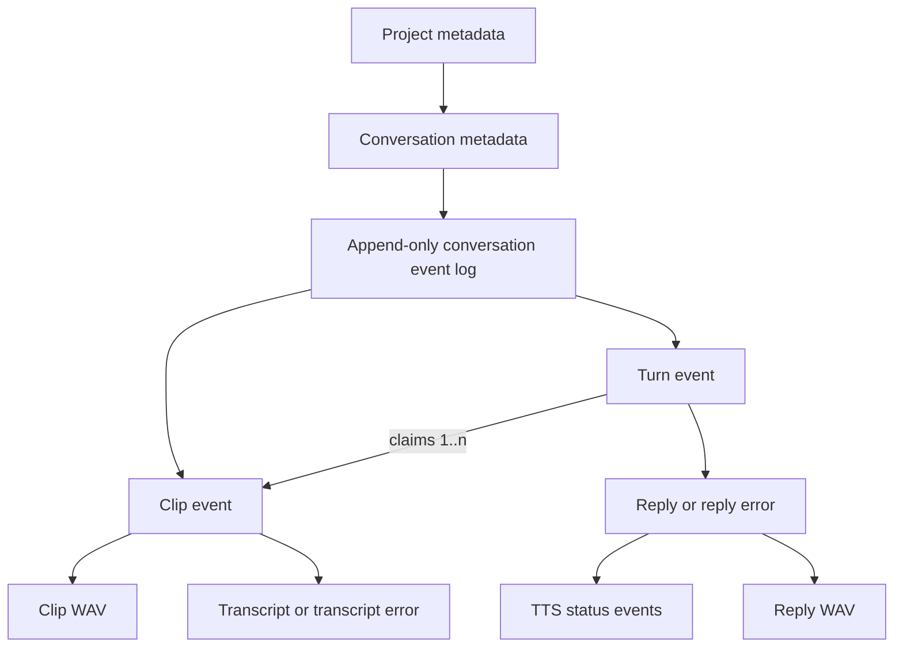

# Current data model

This document describes the data model implemented today. It is an inventory,
not a proposal for the next model. The server is authoritative once a recording
has been uploaded; the browser, iPhone, and Watch also keep pre-upload durability
state locally.

## Mental model

Kibo is a filesystem-backed, event-sourced system organized into projects and
conversations.



The important distinction is that `turns.jsonl` is the source of truth for a
conversation's content and processing history, but it is not the whole data
model:

- `project.json` and `conversation.json` are authoritative for hierarchy and
names. Conversation metadata also contains a derived recent-activity cache.
- `turns.jsonl` is authoritative for clips, transcripts, turns, replies, and
processing outcomes.
- WAV files contain the actual recorded and synthesized audio. An event log
alone cannot reconstruct those bytes.
- In-memory worker and streaming state can be discarded and reconstructed from
durable state, with the caveats listed below.

There is no database, global active project, global active conversation, schema
version, migration framework, or compaction step. `last_activity_at` is the one
denormalized index-like value; it is rebuilt from the event log at startup.

## On-disk server layout

`KIBO_DATA_DIR` defaults to `~/kibo-data`.

```text
kibo-data/
  .kibod.lock
  projects/
    <project-id>/
      project.json
      knowledge/
        instructions.md
        ingested.json
        web/
          <source-id>/
            source.json
            versions/<content-sha256>/content.md
        wiki/
          index.md
          sources/<kind>--<source-id>.md
      conversations/
        <conversation-id>/
          conversation.json
          turns.jsonl
          clips/
            <clip-id>.wav
          recordings/
            <recording-id>/
              manifest.json
              parts/
                <eight-digit-sequence>.wav
          tts/
            <turn-id>.wav
```

`.kibod.lock` is held exclusively for the life of the process, preventing two
`kibod` processes from writing the same data directory. Within a process,
mutations and reads that must be consistent are serialized with one mutex per
`project-id/conversation-id`.

If no projects are found when the store opens, the server creates the starter
project `kibo`. Projects may contain zero conversations; the starter project
and newly created projects do not receive a special `general` conversation.

## Metadata records

### Project

```json
{
  "id": "kibo",
  "name": "Kibo",
  "created_at": 1784142000
}
```

| Field | Meaning |
|---|---|
| `id` | Stable path and API identifier. |
| `name` | Display name, trimmed and limited to 1–100 characters at creation. |
| `created_at` | Server epoch seconds. Used to sort project lists oldest first. |

Creating a project creates only its metadata and empty `conversations/`
directory. There are no project update or delete operations.

### Conversation

```json
{
  "id": "new-conversation-e2a93b17",
  "project_id": "kibo",
  "name": "New conversation",
  "name_source": "placeholder",
  "created_at": 1784142000,
  "last_activity_at": 1784142000
}
```

| Field | Meaning |
|---|---|
| `id` | Stable identifier unique within its project. |
| `project_id` | Owning project. The server checks this when loading the record. |
| `name` | Current display name. |
| `name_source` | `placeholder`, `transcript`, `manual`, or `ai`. `ai` exists in the Rust enum but is not currently produced. |
| `created_at` | Server epoch seconds for chat creation. |
| `last_activity_at` | Derived epoch seconds for the newest durable event, falling back to `created_at`. Conversation lists sort by this value newest first. |

An unnamed conversation starts as `New conversation` with `placeholder` as its
source. After a successful, useful transcript arrives, the server derives a
title from the first useful transcript event: at most eight words and 60
Unicode characters. The metadata file is atomically replaced, the source
becomes `transcript`, and a `conversation_renamed` event is appended. A manual
name is never auto-replaced. Older metadata without `name_source` decodes as
`manual`; older metadata without `last_activity_at` is accepted and backfilled
from the durable log when the store opens.

There is currently no API for renaming or deleting a conversation. The
automatic rename and recent-activity cache are the only metadata updates after
creation.

## Project knowledge workspace

Each project can compile raw conversations and imported URLs into readable
Markdown. This is one concrete built-in feature, not a generic capability
registry. Conversation logs remain authoritative; knowledge files are derived
and can be regenerated.

`instructions.md` contains the project-local instructions used to generate one
source note. `wiki/index.md` is rebuilt deterministically from successful
receipts. Each generated source note has provenance frontmatter containing its
stable source key, kind, content SHA-256, generation, and URL when applicable.

### Canonical conversation documents

Conversation ingestion reconstructs ordered user transcript and assistant reply
sections from `turns.jsonl`. Empty and silent sentinels are excluded. Audio,
errors, rename notifications, and speech-processing events are not part of the
canonical bytes, so events such as `speech_ready` do not make an ingested
conversation dirty.

The canonical bytes are hashed but not copied into a second raw snapshot. The
existing conversation log remains the sole authority.

### Imported URL documents

The browser UI sends a public HTTP(S) URL to Jina Reader and stores its Markdown
result under `web/<source-id>/versions/<content-sha256>/content.md`.
Re-importing the same URL reuses its stable source ID. Identical content is
clean; changed content creates another immutable content-addressed version and
advances `source.json` only after the new content is durable.

### Successful ingestion checkpoint

`ingested.json` records only successful work, keyed by stable logical source
keys such as `conversation:<id>` and `web:<id>`. A receipt contains the source
content hash, knowledge-instructions hash, recipe version, generation, time,
title, kind, and wiki filename.

A source is dirty when its canonical content hash, instructions hash, or recipe
version differs from its last successful receipt. A manual re-ingest bypasses
that comparison. The generated source note and index are atomically replaced
before `ingested.json`; a failure before the checkpoint therefore leaves the
source dirty and safe to retry. Knowledge writes are serialized per project.

### IDs and timestamps

Server-generated IDs are a short lowercase ASCII slug plus an eight-character
UUID suffix. API-supplied project, conversation, clip, and turn IDs must be
1–100 ASCII characters containing only letters, digits, `-`, or `_`.

Durable wall-clock timestamps use whole epoch seconds, except retry deadlines,
which use epoch milliseconds so short backoffs cannot collapse into the same
second:

- `created_at` is assigned by the server to project/conversation metadata.
- `last_activity_at` caches the maximum durable event `at` for a conversation.
- `at` is assigned by the server to each event.
- `recorded_at` is supplied by the client for clips, defaulting to server time
only if the header is missing or invalid.
- `retry_at_ms` is a server-assigned absolute deadline on a `*_retry_scheduled`
event. Workers translate it once to a monotonic timer before sleeping.

The server trusts `recorded_at`. It is not checked against `at` or other clips.

## Conversation event log

Each conversation has an independent append-only `turns.jsonl`. Every complete
line is a JSON object. All events currently have this envelope:

```json
{
  "kind": "...",
  "seq": 1,
  "at": 1784142000
}
```

- `seq` starts at 1 and increases monotonically within one conversation.
- `at` is server epoch seconds.
- `kind` selects the remaining fields.

Production writes enter the store as an opaque typed `JournalWrite`; only the
store serializes it and assigns `seq` and `at`. This prevents new code from
inventing a kind, owner field, stage, or contradictory retry/terminal shape.
Reads deliberately remain open JSON values so legacy records, unknown future
kinds, and recovery fixtures remain readable. All lifecycle consumers on the
server pass those values through one typed `ConversationWorkflow` projection.
That projection defines event precedence, attempt state, runnable work, turn
order, history, API readiness, and browser presentation; workers do not
independently reinterpret the raw fields.

### Event types

The table omits the common `kind`, `seq`, and `at` fields.

| Kind | Additional fields | Meaning |
|---|---|---|
| `clip` | `id`, `file`, `mime`, `ms`, `peak`, `recorded_at`, `sha256` | A committed user recording. `file` is currently `clips/<id>.wav`, `mime` is `audio/wav`, `ms` is client-reported duration, and `peak` is a client-reported percentage capped at 100. Clips assembled from streamed recording parts additionally carry server-computed `samples`, `rate`, and `part_count`. |
| `transcript_started` | `clip`, `attempt` | A transcription attempt began. An unmatched started event is durable interrupted work, not an instruction to start a duplicate task. |
| `transcript_retry_requested` | `clip`, `reason` | Explicitly reopens non-successful transcription at attempt 1. Reasons include `payload_repaired`, `explicit_retry`, `turn_retry`, `startup_recovery`, and `supervisor_recovery`; an already-successful transcript remains authoritative. |
| `transcript_retry_scheduled` | `clip`, `attempt`, `error`, `retry_at_ms` | A retryable transcription attempt failed and its next attempt has a durable deadline. This distinct kind keeps older clients from mistaking a retry for a terminal error. |
| `transcript` | `clip`, `text` | Successful transcription of a clip. Peak-zero clips get the sentinel text `[silent]` without calling the provider. |
| `transcript_error` | `clip`, `attempt`, `error`, `terminal: true` | Transcription exhausted its bounded policy or failed permanently. It stays closed until an explicit retry request. |
| `turn` | `id`, `clips` | An explicit request for Kibo to answer. It atomically claims all clips that are unclaimed at creation time. |
| `reply_started` | `turn`, `attempt` | A model reply attempt began. |
| `reply_retry_requested` | `turn`, `reason` | Explicitly reopens terminal or interrupted reply work at attempt 1. |
| `reply_retry_scheduled` | `turn`, `attempt`, `stage`, `error`, `retry_at_ms` | A retryable model attempt failed and its next attempt has a durable deadline. `stage` is `reply`. |
| `reply` | `turn`, `text`, `answers`, `history_through_seq`; usually `audio`, `interaction_id`, `speech_generation` | Durable assistant text for a turn. `answers` repeats the claimed clip IDs. `history_through_seq` proves the newest preceding reply sequence included in the provider context. A normal reply advertises `tts/<turn>.wav` and preregisters its opaque speech generation before synthesis finishes. Empty/silent input produces `[nothing to answer]` without audio. An audio reply without `speech_generation` is legacy and is conservatively adopted before serving. |
| `reply_error` | `turn`, `attempt`, `stage`, `error`, `terminal: true` | Reply generation ended terminally, or the turn was closed because a claimed transcript failed terminally. `stage` is `reply` or `transcription`. |
| `speech_started` | `turn`, `attempt`, `generation` | A speech synthesis attempt began after reply text was durable. `generation` is an opaque identity for that exact PCM synthesis, not a user-visible ID. |
| `speech_retry_requested` | `turn`, `reason` | Explicitly reopens terminal or interrupted speech work at attempt 1. |
| `speech_retry_scheduled` | `turn`, `attempt`, `error`, `retry_at_ms` | A retryable speech attempt failed and its next attempt has a durable deadline. It does not discard durable reply text. |
| `tts_error` | `turn`, `attempt`, `error`, `terminal: true` | Speech synthesis exhausted its bounded policy or failed permanently. It does not discard durable reply text. |
| `speech_ready` | `turn`, `samples`, `rate`; optional `recovered` | The final reply WAV is durable. `rate` is currently 24,000 Hz; `recovered: true` means the file existed after restart but its ready event did not. |
| `conversation_renamed` | `name`, `source` | Notification that conversation metadata was automatically renamed. `source` is currently `transcript`. |

Events are facts rather than rows to update. A later explicit transition can
supersede an earlier outcome, for example:

```text
transcript_error(terminal) -> transcript_retry_requested -> transcript
speech_retry_scheduled -> speech_started -> speech_ready
```

Each stage is projected as exactly one of due, attempting, retry scheduled,
succeeded, or terminal failure. Success is authoritative. An `*_started` event
without a following result is deliberately non-runnable until recovery appends
an explicit `*_retry_requested`; this prevents hidden in-memory ownership from
changing the meaning of the log. Retry policy is bounded independently for
transcription, reply, and speech. An explicit retry request resets that stage's
attempt budget. Network failures, timeouts, rate limits, and provider 5xx
responses consume the bounded retry policy; other provider 4xx responses and
permanent local input errors close immediately instead of spending arbitrary
attempts on unchanged input.

The workflow parser treats older error events without `terminal` or `attempt`
as retryable legacy failures and can read the former seconds-based `retry_at`
field defensively. It rejects contradictory terminal events with retry
deadlines. New writes use distinct retry-scheduled kinds and only
`retry_at_ms`; the old error kinds are reserved for terminal outcomes so a
server-first rollout remains safe for already-installed Apple clients.

## Relationships and derived state

Relationships are stored as string IDs rather than enforced foreign keys:

- `conversation.project_id -> project.id`
- `clip.file -> clips/<clip.id>.wav`
- all `transcript_*` events and `transcript.clip -> clip.id`
- `turn.clips[] -> clip.id`
- `reply.turn -> turn.id`
- `reply.answers[] -> clip.id` (redundant with `turn.clips[]`)
- `reply.audio -> tts/<turn.id>.wav`
- all `reply_*`, `speech_*`, and `tts_error` events' `turn -> turn.id`

The code assumes these references are valid. It does not validate the full log
on load or reject every possible duplicate logical record.

### Pending clips

A clip is pending when its ID does not occur in any `turn.clips` array. Asking
Kibo creates one turn that claims every pending clip in the conversation. The
claim is serialized with event appends and is therefore atomic relative to
uploads and other turn submissions.

Claimed clips are sorted by `(recorded_at, seq)`, not merely upload order. This
allows offline recordings uploaded later to retain client capture order. It
also means an inaccurate client clock affects the order of text sent to the
model.

### Turn completion

The server treats a durable `reply` as the completion marker for model work. A
reply's text and audio have separate durability boundaries:

1. `reply` is appended before TTS begins.
2. While synthesis is active, speech can be streamed from memory.
3. The final WAV is atomically written to `tts/<turn>.wav`.
4. `speech_ready` is appended.

Consequently, `reply.audio` means “this reply has a speech resource,” not “the
final speech file is already ready.” `speech_ready` or the speech endpoint is
the authoritative readiness check.

### Conversation history sent to the model

For a new turn, the canonical workflow walks earlier turns in log order and
includes only turns that have projected user text and a successful reply. A
user history message is the same filtered text used for the original turn; the
assistant message is the durable reply text.

The latest earlier `reply.interaction_id` is offered to Gemini as a provider-side
continuation cache only when its `history_through_seq` proves that it covered
every preceding durable reply. Legacy monotonic chains remain readable, but an
out-of-order recovered reply invalidates all later legacy anchors that lack that
proof. The next durable-history request records fresh coverage and can establish
a new anchor. If the cache is absent or Gemini rejects it, Kibo rebuilds the
prompt from durable history. Provider state is therefore an optimization, not
the source of truth.

Empty, `[silent]`, and `[no speech]` transcripts are filtered by that single
projection for both the current turn and durable fallback history.

## Write and processing lifecycle

### 1. Record and upload a clip

Before the server sees a clip, each frontend tries to save it in a local retry
spool. The client then sends a whole WAV with a stable clip ID, SHA-256, duration,
peak, and recording time.

On the server:

1. The API buffers up to 20 MiB and checks the RIFF/WAVE header.
2. The store verifies the supplied SHA-256.
3. It writes a unique temporary file, syncs it, renames it to the final clip
path, and syncs the containing directory.
4. It appends and syncs the `clip` event.
5. Only then does the API return `201 Created` and request transcription.

The operation is idempotent by `(conversation, clip ID, content hash)`:

- The same ID and hash returns success without another event.
- The same ID with different bytes returns `409 Conflict`.
- If the event exists but the file is missing or corrupt, a matching retry
appends `transcript_retry_requested`, then restores the payload and returns the
distinct internal `Repaired` outcome. The intent is synced before replacing the
bytes under the same conversation lock, so a crash cannot leave repaired bytes
indistinguishable from an inert replay; normal scheduling begins only after the
payload replacement succeeds.
- If the event and payload are both intact, a matching replay is workflow-inert:
it may schedule already-due work after a lost response, but it never reopens a
terminal provider failure.
- If the file exists without an event after a crash, a matching retry appends
the missing event; different bytes are never silently overwritten.

The ReSpeaker uses a bounded-memory variant of this lifecycle for recordings
that can outlast device RAM. It sends canonical mono 16 kHz signed-16 WAV parts
to a stable recording ID and sequence. A new part returns `201`; an identical
retry returns `200`; the same sequence with different bytes returns `409`.
Each acknowledged part and every newly created ancestor directory are synced
before success is returned.

Staged parts live under `recordings/` and are not events, pending clips, or
transcription inputs. An explicit completion request supplies `part_count` and
`total_samples`. The store validates a contiguous sequence, streams the PCM
payloads into one final WAV, syncs and renames it, and appends exactly one
ordinary `clip` event. Completion retries return the same clip without another
event, including recovery from a crash between final rename and event append.
If the committed payload itself is missing or corrupt, a completion retry
reassembles the staged parts and repairs it under the single-clip contract:
`transcript_retry_requested` is durable before the bytes are restored, and the
internal outcome is the distinct `Repaired`. Parts are currently retained after
completion so a later ambiguous part retry can still be compared byte-for-byte;
age-based cleanup is future work.

### 2. Transcribe and name

Only one in-memory transcription supervisor runs per clip. Before calling the
provider it conditionally appends `transcript_started` while the projected
attempt is still due, and verifies the bytes it read against the SHA-256 in the
durable `clip` event. A corrupt payload therefore cannot produce an
authoritative transcript. Results are also conditionally appended only while
that same attempt is current, so a payload-repair or recovery transition that
linearizes first supersedes the in-flight result. It then appends `transcript`, a
`transcript_retry_scheduled` event with a millisecond deadline, or a terminal
`transcript_error`; the same supervisor sleeps until scheduled work is due. A useful first
transcript may then update the conversation name and append
`conversation_renamed`.

The in-memory set only deduplicates supervisors. It is not lifecycle state. If
an append/read failure leaves a durable started attempt without a result, the
supervisor backs off and appends `transcript_retry_requested` before trying
again.

### 3. Create a turn

`POST .../turns` supplies a client-generated `turn_id`. Under the conversation
lock, the store either:

- returns the existing turn and its original clip claim when that ID already
exists; this replay may reschedule open work after a lost response but never
reopens a terminal stage;
- appends a new `turn` claiming all pending clips; or
- returns `409` when a new ID has nothing to claim.

Clients retain the command ID locally until the request succeeds, so retrying a
lost response normally reuses the same claim. Workflow control is separate:
`POST .../clips/<clip>/retry` explicitly reopens a terminal transcription, and
`POST .../turns/<turn>/retry` reopens the earliest terminal prerequisite,
reply, or speech stage. Repeating either retry command while work is already
open is inert. The terminal-state check and retry-event append share the
conversation lock, so concurrent or stale commands cannot append a reopen
behind a successful result. Phone and Watch expose these commands on failed
timeline cards.

### 4. Produce reply text and speech

There is at most one turn supervisor per conversation. It reads the canonical
workflow in turn order. It waits for each claimed clip to succeed or fail
terminally, appends `reply_started`, calls the model, and appends a retry
schedule, terminal `reply_error`, or `reply`. Before publishing a reply that
advertises audio, the server registers its blocking speech endpoint so an
already-installed client cannot race the new speech stage and receive a
transient `425`. Once text is durable, speech is a separate substate:
`speech_started`, then a retry schedule, terminal `tts_error`, or the durable
WAV followed by `speech_ready`.

A terminal transcription-stage turn error and terminal provider failures are
complete for scheduling purposes, so one bad turn cannot starve later turns.
Retry-scheduled reply and speech failures remain runnable at `retry_at_ms`. Text
survives speech failure and is presented independently from audio readiness.
Transcription-stage reply failure is a projection of its claimed clips rather
than independent work: once every claimed transcript succeeds, the canonical
workflow derives reply work as due even if no second reopen event was written.
The compatibility `reply_error` notification is appended only while the
failure predicate still holds under the conversation lock, so a stale turn
decision cannot race behind transcript recovery.

Every live and stored PCM response includes `X-Speech-Generation`, matching the
opaque generation on `speech_started`. `from_sample` resumes only within that
generation. Updated clients echo their expected generation in the same header
on a resumed request. A `412 Precondition Failed` or a response carrying a
different generation makes the client discard the earlier ledger and renderer
and request sample zero, preventing prefixes and suffixes from different
provider attempts from being spliced together.
Updated Apple clients treat the absent header from an older server as `legacy`
while connected to that server. After a server upgrade, any persisted legacy
WAV is conservatively adopted under a stable `adopted-<sha256>` token and a
rollover index greater than one before it is served. A client carrying `legacy`
therefore restarts, and a headerless older client requesting a nonzero offset
gets `412`; this is necessary because an old journal cannot prove how many
pre-crash synthesis prefixes were streamed before the final WAV was saved.
Replaying from zero remains valid.
Infrastructure failures in reading or appending the journal do not make work
dormant: the supervisor backs off, records an explicit recovery transition for
any interrupted started stage, and drains again.

Turns in the same conversation are processed serially. Different conversations
can process concurrently, while a process-wide semaphore bounds provider calls
to three. Stable per-item jitter spreads retry deadlines so startup recovery
does not send a synchronized backlog to Gemini.

## Startup and recovery

When `kibod` starts, it scans every project and conversation:

- `last_activity_at` is reconciled with the maximum `at` in the durable event
log and atomically persisted. This backfills legacy metadata and repairs a
cache write missed by a crash or filesystem error. Reconciliation never edits
the log; a corrupt log or failed cache write is reported without making the
derived cache authoritative.
- Every interrupted `transcript_started`, `reply_started`, or `speech_started`
gets an explicit stage-specific retry-request event before work is scheduled.
- Every due or retry-scheduled clip is submitted to a transcription
supervisor. Terminal failures remain closed.
- Every conversation with incomplete turn work is submitted to its turn
supervisor. Existing replies are not regenerated. A reply whose ready event
points at a missing or corrupt WAV gets `speech_retry_requested` and is sent
through TTS again.
- A valid reply WAV missing `speech_ready` gets a recovered ready event.

Recovery is fail-fast before the listener is served: if any required retry
transition cannot be read or appended, `app` returns the error and the process
exits for its service manager to retry. Per-conversation failures are not logged
and silently abandoned. Normal turn supervision also performs transcription
scheduling inside its retry loop, so a transient scheduling read failure cannot
leave a transcription-blocked turn dormant.

The JSONL reader ignores an incomplete final line. Before the next append, the
writer either adds a missing newline to a complete final JSON value or truncates
the torn tail. Corruption in an earlier, newline-terminated record is a hard
read error.

Temporary upload files and other unreferenced files are not generally scanned,
quarantined, or garbage-collected.

## Read APIs and live delivery

The data-oriented API is:

| Endpoint | Model operation |
|---|---|
| `GET /v1/projects` | List project metadata. |
| `POST /v1/projects` | Create an empty project. |
| `GET /v1/projects/{project}/conversations` | List conversation metadata. |
| `POST /v1/projects/{project}/conversations` | Create a named or placeholder conversation. |
| `PUT /v1/projects/{project}/conversations/{conversation}/clips/{clip}` | Commit a WAV and `clip` event. |
| `PUT .../recordings/{recording}/parts/{sequence}` | Durably stage one canonical WAV part, idempotently by ID, sequence, and hash. |
| `POST .../recordings/{recording}/complete` | Assemble staged parts and atomically expose one ordinary clip. |
| `GET .../clips/{clip}/audio` | Return the stored user WAV. |
| `POST .../turns` | Idempotently create a turn and claim pending clips. |
| `GET .../turns/{turn}/speech?from_sample=N` | Stream live or stored signed-16 little-endian mono PCM from a sample offset within one `X-Speech-Generation`. |
| `GET .../events?after=N` | Return `{events, latest_seq}` for events with `seq > N`. |
| `WS .../events?after=N` | Send catch-up events, then transient live events. |

The durable log is authoritative; broadcasts are only a latency mechanism. A
WebSocket subscribes before reading catch-up, so a concurrent append cannot be
missed. The server sends only the next journal sequence, discards queued
broadcast copies already delivered by catch-up, and disconnects on a forward
gap or failed durable read. Reconnect then resumes from the last delivered
cursor and rereads the authoritative journal. A slow receiver that exceeds the
128-event broadcast buffer follows the same reconnect path.

## Frontend projections

### Browser

The browser UI is mostly a server-side projection. `ui.rs` rereads the full log
and renders the typed `ConversationWorkflow`, so its terminality and precedence
rules are identical to the worker and speech API. It renders:

- each turn in event order;
- each claimed recording in the order stored on that turn;
- durable reply text independently from speech state, a terminal error, or a
“Thinking…”/“Retrying…” placeholder; and
- all still-unclaimed clips after the turns.

Projects appear as folders in the browser. The root opens a project-level page,
which remains useful when the project has no chats. “New chat” creates an
unnamed placeholder conversation immediately and navigates to it; the web flow
does not ask for a room-style name. Project pages and navigation list chats by
recent activity.

The browser receives event notifications over WebSocket, advances a local
sequence cursor, and refreshes the entire server-rendered timeline fragment. It
handles `conversation_renamed` directly to update the heading, document title,
and current navigation item.

Before upload, browser WAVs and metadata are stored in IndexedDB under a key
derived from conversation URL and clip ID. The browser removes that local entry
after any successful upload response. A pending turn ID is stored in
`localStorage` per conversation URL until turn creation succeeds.

### iPhone and Watch

The Apple clients decode metadata into `KiboProject` and `KiboConversation` and
decode log records into a generated, forward-compatible `KiboEvent` containing
the common envelope plus all currently advertised lifecycle fields, including:

```text
attempt, generation, retry_at_ms, terminal, stage, reason
```

Unknown server fields are ignored. Apple uses ordered stage projections. The
new `*_retry_scheduled` kinds remain pending. New writes reserve the old
`*_error` kinds with `terminal: true` for terminal outcomes, while legacy
errors with a missing or false terminal flag remain retrying and accept later
started/success events. An explicit retry request is the only transition that
reopens a terminal failure; successful transcript and reply values remain
authoritative.
Initial attempts and retries have distinct presentation. iPhone and Watch use
the same reply-readiness and autoplay action projection: audio is not playable
until `speech_started`, an awaited turn survives transport and speech retries,
and terminal speech failure stops the intent. Failed clip and turn cards issue
the dedicated retry commands rather than replaying upload/create operations.

Both clients poll the full event log rather than using `after` or WebSockets:
roughly every two seconds when idle and every 250 ms while a turn appears
pending. They build their timelines client-side using ordered transcript,
reply, and speech substates, turns in log order, then unclaimed clips.

The phone and Watch each keep their own durable pre-upload spool in Application
Support: a WAV plus a JSON sidecar containing the stable ID, server URL,
project/conversation destination, duration, peak, and recording/enqueue times.
This local spool is not merged into the conversation event projection; pending
uploads are exposed separately as a count/status. They also persist selected
project/conversation IDs and the in-flight turn command ID in `UserDefaults`.

Automatic conversation names are not fully reflected on Apple clients. Their
generated event type decodes the rename's `name` and `source`, but the current
projection does not apply those fields and ordinary event polling does not
refresh the conversation list. The renamed metadata appears after a
later conversation-list reload, while the web UI updates immediately.

## Durability and consistency boundary

What the current server guarantees at a successful clip response:

- The received bytes matched the supplied SHA-256.
- The final clip file was synced and its directory entry was synced.
- The corresponding event was appended and synced.
- A retry with the same ID and bytes is safe.

Project and conversation metadata use write-to-temp, file sync, atomic rename,
and parent-directory sync. TTS files use a `.part` file, finalize and sync it,
then rename and sync the parent. Event appends are synced before returning. An
event operation does not report failure solely because the derived
`last_activity_at` write failed after the event committed; startup
reconciliation repairs that cache from the log.

That guarantee ends at one local filesystem. The repository contains no backup,
replication, restore, or retention policy. It also does not make the frontend's
WAV-finalization and local-spool registration one transaction; the separate
data-loss review documents those client-side capture gaps in detail.

## Current sharp edges

These are observed properties of the current implementation that matter when
evolving the model.

1. **The event envelope is open and unversioned.** New in-process writes are
typed, but durable reads remain generic JSON for forward and legacy
compatibility. The typed server projection validates the known lifecycle
subset, but unknown kinds and malformed references are ignored rather than
rejecting the full log.
2. **Conversation rename is a two-record update.** `conversation.json` is
replaced before `conversation_renamed` is appended, so a crash or append
failure can update metadata without notifying event consumers. Apple clients
do not currently use the event to refresh their conversation list.
3. **A reply advertises an audio resource before the final file is complete.**
The explicit speech substate makes readiness deterministic, but clients still
have to stream an attempting reply or wait for `speech_ready`; `reply.audio`
alone does not mean the WAV is durable.
4. **Most operations scan the full log.** Reads, sequence allocation, pending
clip calculation, recovery, timeline rendering, history construction, and
many idempotency checks are O(number of events). The phone and Watch also
download the full log on every poll.
5. **Ordering combines trusted and untrusted clocks.** Event order is stable by
server sequence, but clips inside a turn are reordered by client-provided
`recorded_at`. Ordinary timestamps have one-second precision; retry deadlines
have millisecond precision.
6. **Logical duplicates are mostly tolerated.** A clip and turn are protected
by their creation APIs, but transcript, reply, and status event uniqueness is
conventional. The workflow projection applies deterministic ordered precedence,
but malformed duplicate transitions remain in the log.
7. **The log and blob store only grow.** There are no edit, delete, soft-delete,
archive, garbage collection, or compaction operations, and no retention
metadata.
8. **Live event delivery follows durable sequence order.** The WebSocket server
removes catch-up/broadcast overlap. If concurrently published events arrive out
of order or the broadcast buffer has a gap, it disconnects before advancing the
cursor so reconnect can recover the missing sequence from the log.
9. **Local pre-upload data is a separate model.** Browser, phone, and Watch
spools have their own fields and recovery behavior and do not appear in the
server log until upload commits. A complete end-to-end model therefore has
to account for both “captured locally” and “committed to the server.”

## Code map

- `kibod/src/model.rs` — typed project/conversation metadata and API request
shapes.
- `kibod/src/knowledge.rs` — canonical conversation projection, Jina Reader,
content-addressed URL imports, ingestion receipts, and Markdown persistence.
- `kibod/src/journal.rs` — strict shapes and constructors for new durable events.
- `kibod/src/store.rs` — filesystem layout, event append/read, clip and turn
idempotency, metadata writes, and crash repair.
- `kibod/src/workflow.rs` — canonical typed journal projection, lifecycle
substates, turn actions, and durable history.
- `kibod/src/state.rs` — retry policy, supervised transcription/reply/speech
mechanisms, broadcasts, and startup recovery.
- `kibod/src/api.rs` — HTTP/WebSocket representation of the model.
- `kibod/src/ui.rs` — server-side browser timeline projection.
- `kibod/assets/app.js` — browser local spool, turn command persistence, event
cursor, and live refresh.
- `ios/Shared/Models.swift` — Apple metadata/event DTOs and timeline projection.
- `ios/Shared/KiboAPI.swift` — Apple HTTP representation.
- `ios/Kibo/AppStore.swift` and `ios/Shared/PendingUploadSpool.swift` — iPhone
selection, polling, commands, and pre-upload persistence.
- `ios/KiboWatch/KiboWatchApp.swift` and `ios/KiboWatch/WatchAudio.swift` — Watch
equivalents.
